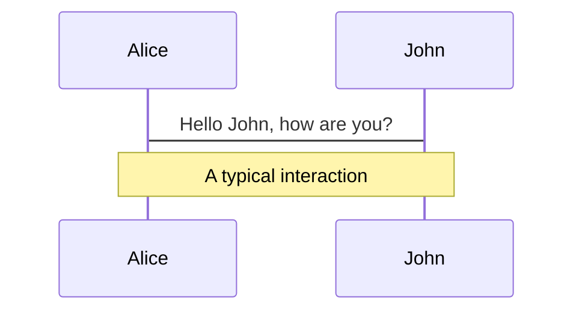
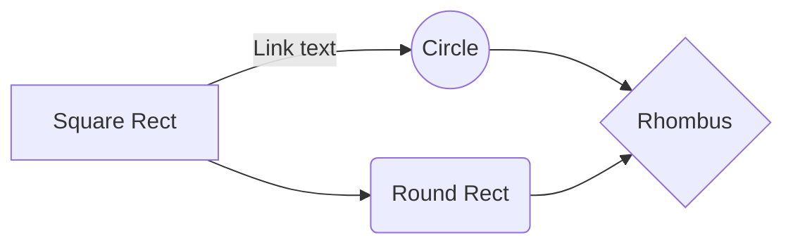
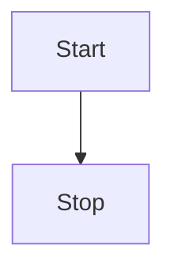
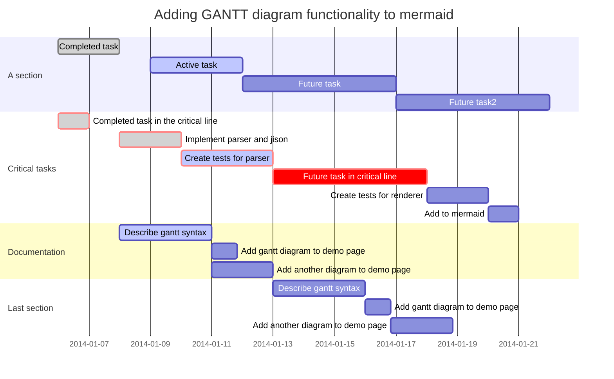
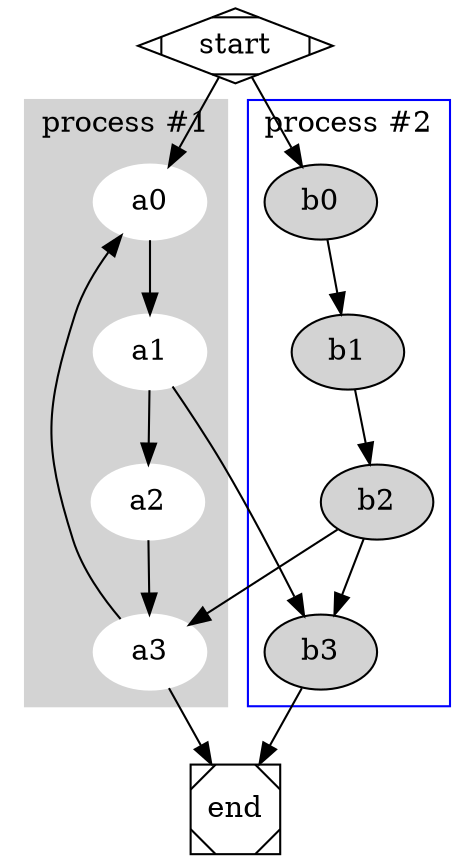

<a name="headers" class="anchor-link" />

## Headers

```no-highlight
# H1
## H2
### H3
#### H4
##### H5
###### H6

Alternatively, for H1 and H2, an underline-ish style:

Alt-H1
======

Alt-H2
------
```

# H1

## H2

### H3

#### H4

##### H5

###### H6

Alternatively, for H1 and H2, an underline-ish style:

# Alt-H1

## Alt-H2

<a name="emphasis" class="anchor-link" />

## Emphasis

```no-highlight
Emphasis, aka italics, with *asterisks* or _underscores_.

Strong emphasis, aka bold, with **asterisks** or __underscores__.

Combined emphasis with **asterisks and _underscores_**.

Strikethrough uses two tildes. ~~Scratch this.~~
```

Emphasis, aka italics, with _asterisks_ or _underscores_.

Strong emphasis, aka bold, with **asterisks** or **underscores**.

Combined emphasis with **asterisks and _underscores_**.

Strikethrough uses two tildes. ~~Scratch this.~~

<a name="lists" class="anchor-link" />

## Lists

```no-highlight
1. First ordered list item
2. Another item
  * Unordered sub-list.
1. Actual numbers don't matter, just that it's a number
  1. Ordered sub-list
4. And another item.

   Some text that should be aligned with the above item.

* Unordered list can use asterisks
- Or minuses
+ Or pluses
```

1. First ordered list item
2. Another item
   - Unordered sub-list.
3. Actual numbers don't matter, just that it's a number
   1. Ordered sub-list
4. And another item.
   Some text that should be aligned with the above item.

- Unordered list can use asterisks
- Or minuses
- Or pluses

<a name="links"/>

## Links

There are two ways to create links.

```no-highlight
[I'm an inline-style link](https://www.google.com)

[I'm a reference-style link][Arbitrary case-insensitive reference text]

[You can use numbers for reference-style link definitions][1]

Or leave it empty and use the [link text itself]

URLs and URLs in angle brackets will automatically get turned into links.
http://www.example.com or <http://www.example.com> and sometimes
example.com (but not on Github, for example).

Some text to show that the reference links can follow later.

[arbitrary case-insensitive reference text]: https://www.mozilla.org
[1]: http://slashdot.org
[link text itself]: http://www.reddit.com
```

[I'm an inline-style link](https://www.google.com)

[I'm a reference-style link](https://www.mozilla.org)

[You can use numbers for reference-style link definitions](http://slashdot.org)

Or leave it empty and use the [link text itself](http://www.reddit.com)

URLs and URLs in angle brackets will automatically get turned into links.
http://www.example.com or <http://www.example.com> and sometimes
example.com (but not on Github, for example).

Some text to show that the reference links can follow later.

<a name="images"/>

## Images

```no-highlight
Here's our logo (hover to see the title text):

Inline-style:


Reference-style:
![alt text][logo]

[logo]: https://github.com/adam-p/markdown-here/raw/master/src/common/images/icon48.png "Logo Title Text 2"
```

Here's our logo (hover to see the title text):

Inline-style:


Reference-style:


<a name="code"/>

## Code and Syntax Highlighting

Code blocks are part of the Markdown spec, but syntax highlighting isn't. However, many renderers -- like Github's and _Markdown Here_ -- support syntax highlighting. _Markdown Here_ supports highlighting for dozens of languages (and not-really-languages, like diffs and HTTP headers); to see the complete list, and how to write the language names, see the [highlight.js demo page](http://softwaremaniacs.org/media/soft/highlight/test.html).

```no-highlight
Inline `code` has `back-ticks around` it.
```

Inline `code` has `back-ticks around` it.

Blocks of code are either fenced by lines with three back-ticks <code>`</code>, or are indented with four spaces. I recommend only using the fenced code blocks -- they're easier and only they support syntax highlighting.

<pre lang="no-highlight"><code>```javascript
var s = "JavaScript syntax highlighting";
alert(s);
```

```python
s = "Python syntax highlighting"
print s
```

```
No language indicated, so no syntax highlighting.
But let's throw in a &lt;b&gt;tag&lt;/b&gt;.
```
</code></pre>

```javascript
var s = 'JavaScript syntax highlighting'
alert(s)
```

```python
s = "Python syntax highlighting"
print s
```

```
No language indicated, so no syntax highlighting in Markdown Here (varies on Github).
But let's throw in a <b>tag</b>.
```

Again, to see what languages are available for highlighting, and how to write those language names, see the [highlight.js demo page](http://softwaremaniacs.org/media/soft/highlight/test.html).

<a name="tables"/>

## Tables

Tables aren't part of the core Markdown spec, but they are part of GFM and _Markdown Here_ supports them. They are an easy way of adding tables to your email -- a task that would otherwise require copy-pasting from another application.

```no-highlight
Colons can be used to align columns.

| Tables        | Are           | Cool  |
| ------------- | :-----------: | ----: |
| col 3 is      | right-aligned | $1600 |
| col 2 is      | centered      | $12   |
| zebra stripes | are neat      | $1    |

The outer pipes (|) are optional, and you don't need to make the raw Markdown line up prettily. You can also use inline Markdown.

| | Markdown | Less           | Pretty     |     |
| | ------------- | --------------- | ---------- |------- |
| | *Still*   | `renders` | **nicely** | |
| | 1               | 2                 | 3          |          |
```

Colons can be used to align columns.

| Tables        |      Are      |  Cool |
| ------------- | :-----------: | ----: |
| col 3 is      | right-aligned | $1600 |
| col 2 is      |   centered    |   $12 |
| zebra stripes |   are neat    |    $1 |

The outer pipes (|) are optional, and you don't need to make the raw Markdown line up prettily. You can also use inline Markdown.

| Markdown | Less      | Pretty     |
| -------- | --------- | ---------- |
| _Still_  | `renders` | **nicely** |
| 1        | 2         | 3          |

<a name="blockquotes"/>

## Blockquotes

```no-highlight
> Blockquotes are very handy in email to emulate reply text.
> This line is part of the same quote.

Quote break.

> This is a very long line that will still be quoted properly when it wraps. Oh boy let's keep writing to make sure this is long enough to actually wrap for everyone. Oh, you can *put* **Markdown** into a blockquote.
```

> Blockquotes are very handy in email to emulate reply text.
> This line is part of the same quote.

Quote break.

> This is a very long line that will still be quoted properly when it wraps. Oh boy let's keep writing to make sure this is long enough to actually wrap for everyone. Oh, you can _put_ **Markdown** into a blockquote.

<a name="html"/>

## Inline HTML

You can also use raw HTML in your Markdown, and it'll mostly work pretty well.

```no-highlight
<dl>
  <dt>Definition list</dt>
  <dd>Is something people use sometimes.</dd>

  <dt>Markdown in HTML</dt>
  <dd>Does *not* work **very** well. Use HTML <em>tags</em>.</dd>
</dl>
```

<dl>
  <dt>Definition list</dt>
  <dd>Is something people use sometimes.</dd>

  <dt>Markdown in HTML</dt>
  <dd>Does \*not\* work \*\*very\*\* well. Use HTML <em>tags</em>.</dd>
</dl>

<a name="hr"/>

## Horizontal Rule

```
Three or more...

---

Hyphens

***

Asterisks

___

Underscores
```

Three or more...

---

Hyphens

---

Asterisks

---

Underscores

<a name="lines"/>

## Line Breaks

My basic recommendation for learning how line breaks work is to experiment and discover -- hit &lt;Enter&gt; once (i.e., insert one newline), then hit it twice (i.e., insert two newlines), see what happens. You'll soon learn to get what you want. "Markdown Toggle" is your friend.

Here are some things to try out:

```
Here's a line for us to start with.

This line is separated from the one above by two newlines, so it will be a *separate paragraph*.

This line is also a separate paragraph, but...
This line is only separated by a single newline, so it's a separate line in the *same paragraph*.
```

Here's a line for us to start with.

This line is separated from the one above by two newlines, so it will be a _separate paragraph_.

This line is also begins a separate paragraph, but...
This line is only separated by a single newline, so it's a separate line in the _same paragraph_.

(Technical note: _Markdown Here_ uses GFM line breaks, so there's no need to use MD's two-space line breaks.)

<a name="videos"/>

## YouTube Videos

```no-highlight
`youtube:https://www.youtube.com/embed/2Xc9gXyf2G4`
```

`youtube:https://www.youtube.com/embed/2Xc9gXyf2G4`

<a name="diagrams"/>

## Diagrams with Mermaid

> Mermaid - a simple markdown-like script language for generating charts from text via javascript
>
> [Mermaid Docs](https://mermaidjs.github.io/)

### Sequence Diagrams

<pre lang="no-highlight"><code>```mermaid
sequenceDiagram
    Alice->John: Hello John, how are you?
    Note over Alice,John: A typical interaction
```
</code></pre>



### Flowcharts Left/Right

<pre lang="no-highlight"><code>```mermaid
graph LR
    A[Square Rect] -- Link text --> B((Circle))
    A --> C(Round Rect)
    B --> D{Rhombus}
    C --> D
```
</code></pre>



### Flowcharts Top/Down

<pre lang="no-highlight"><code>```mermaid
graph TD
    Start --> Stop
```
</code></pre>



### Gantt Charts

<pre lang="no-highlight"><code>```mermaid
gantt
       dateFormat  YYYY-MM-DD
       title Adding GANTT diagram functionality to mermaid

       section A section
       Completed task            :done,    des1, 2014-01-06,2014-01-08
       Active task               :active,  des2, 2014-01-09, 3d
       Future task               :         des3, after des2, 5d
       Future task2              :         des4, after des3, 5d

       section Critical tasks
       Completed task in the critical line :crit, done, 2014-01-06,24h
       Implement parser and jison          :crit, done, after des1, 2d
       Create tests for parser             :crit, active, 3d
       Future task in critical line        :crit, 5d
       Create tests for renderer           :2d
       Add to mermaid                      :1d

       section Documentation
       Describe gantt syntax               :active, a1, after des1, 3d
       Add gantt diagram to demo page      :after a1  , 20h
       Add another diagram to demo page    :doc1, after a1  , 48h

       section Last section
       Describe gantt syntax               :after doc1, 3d
       Add gantt diagram to demo page      :20h
       Add another diagram to demo page    :48h
```
</code></pre>



## Graphs with viz.js and graphviz

> graphviz - Graphviz is open source graph visualization software. Graph visualization is a way of representing structural information as diagrams of abstract graphs and networks
>
> [graphviz](http://www.graphviz.org/)
>
> viz.js - A hack to put Graphviz on the web
>
> [viz.js](http://viz-js.com/)

###

<pre lang="no-highlight"><code>```dot
digraph G {

	subgraph cluster_0 {
		style=filled;
		color=lightgrey;
		node [style=filled,color=white];
		a0 -> a1 -> a2 -> a3;
		label = "process #1";
	}

	subgraph cluster_1 {
		node [style=filled];
		b0 -> b1 -> b2 -> b3;
		label = "process #2";
		color=blue
	}
	start -> a0;
	start -> b0;
	a1 -> b3;
	b2 -> a3;
	a3 -> a0;
	a3 -> end;
	b3 -> end;

	start [shape=Mdiamond];
	end [shape=Msquare];
}
```
</code></pre>


